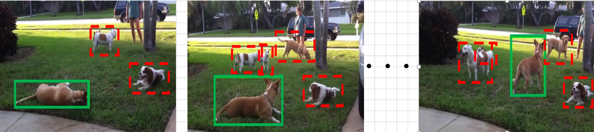
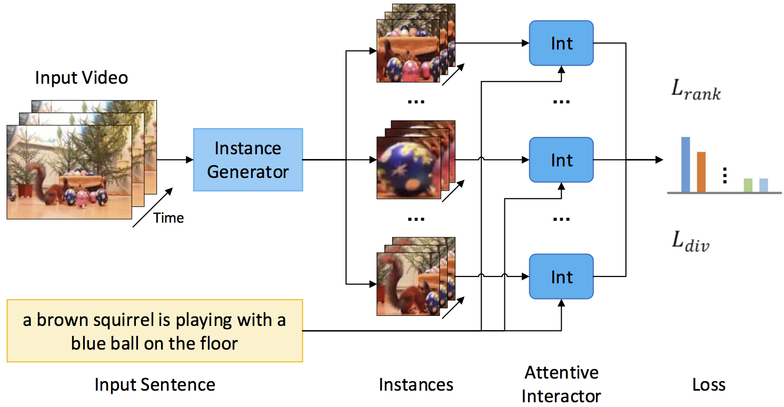

# Weakly-Supervised Spatio-Temporally Grounding Natural Sentence in Video  

This repo contains the main baselines of VID-sentence dataset introduced in WSSTG.
Please refer to [our paper](https://arxiv.org/abs/1906.02549) and the [repo](https://github.com/JeffCHEN2017/VID-sentence) for the information of VID-sentence dataset.


### Task

<p align="center">
<figcaption>Description: "A brown and white dog is lying on the grass and then it stands up."</figcaption>
</p>
<p align="center">

</p>
<p align="center">
<figcaption>The proposed WSSTG task aims to localize a spatio-temporal tube (i.e., the sequence of green bounding boxes) in the video which semantically corresponds to the given sentence, with no reliance on any spatio-temporal annotations during training.</figcaption>
</p>

### Architecture

<p align="center">
<figcaption>The architecture of the proposed method.</figcaption>
</p>
<p align="center">

</p>

### Contents
1. [Requirements: software](#requirements-software)
2. [Installation](#installation)
3. [Training](#Training)
4. [Testing](#Testing)

### Requirements: software

- Pytorch (version=0.4.0)
- python  2.7 
- numpy
- scipy
- magic
- easydict
- dill
- matplotlib
- tensorboardX


### Installation

1. Clone the WSSTG repository and VID-sentence reposity

```Shell
    git clone https://github.com/JeffCHEN2017/WSSTG.git
    git clone https://github.com/JeffCHEN2017/VID-Sentence.git
    ln -s VID-sentence_ROOT/data/ILSVRC WSSTG_ROOT/data
```
2. Download [tube proposals](https://drive.google.com/file/d/1SHwXtlb7V8PH4_60-0-VZYL-7kXEG_Wj/view?usp=sharing), [RGB feature](https://drive.google.com/file/d/1ll_AkiByvQsJTdPNVt1TH6BUPbQxjvG_/view?usp=sharing) and [I3D feature](https://drive.google.com/file/d/1SwPGweipeuREZrAXGzu7nPACy9vXNmmp/view?usp=sharing) from Google Drive.

3. Extract  *.tar files and make symlinks between the download data and the desired data folder

```Shell
tar xvf tubePrp.tar
ln -s tubePrp $WSSTG_ROOT/data/tubePrp

tar xvf vid_i3d.tar vid_i3d
ln -s vid_i3d $WSSTG_ROOT/data/vid_i3d
ln -s $WSSTG_ROOT/data/vid_i3d/val test

tar xvf vid_rgb.tar vid_rgb
ln -s vid_rgb $WSSTG_ROOT/data/vid_rgb
ln -s $WSSTG_ROOT/data/vid_rgb/vidTubeCacheFtr/val test
```

  Note: We extract the tube proposals using the method proposed by [Gkioxari and Malik](https://arxiv.org/abs/1411.6031) .A python implementation [here](ttps://www.mi.t.u-tokyo.ac.jp/projects/person_search/) is provided by Yamaguchi etal..
  We extract singel-frame propsoals and RGB feature for each frame using a [faster-RCNN](https://arxiv.org/abs/1506.01497) model pretrained on COCO dataset, which is provided by [Jianwei Yang](https://github.com/jwyang/faster-rcnn.pytorch).
  We extract [I3D-RGB and I3D-flow features](https://arxiv.org/abs/1705.07750) using the model provided by [Carreira and Zisserman](https://github.com/deepmind/kinetics-i3d.git).


### Training
```Shell
cd $WSSTG_ROOT
sh scripts/train_video_emb_att.sh
```
Notice: Because the changes of batch sizes and the random seed, the performance may be slightly different from our submission. We provide a checkpoint here which achieves similar performance (38.1 VS 38.2 on the  accuracy@0.5 ) to the model we reported in the paper.

### Testing
Download the checkpoint from [Google Drive](https://drive.google.com/file/d/1oM0J4jIbcd4SYo9T29ydk3gugoOjFCKA/view?usp=sharing), put it in  WSSTG_ROOT/data/models and run
```Shell
cd $WSSTG_ROOT
sh scripts/test_video_emb_att.sh
```

### License

WSSTG is released under the CC-BY-NC 4.0 LICENSE (refer to the LICENSE file for details).

### Citing WSSTG

If you find this repo useful in your research, please consider citing:

    @inproceedings{chen2019weakly,
        Title={Weakly-Supervised Spatio-Temporally Grounding Natural Sentence in Video},
        Author={Chen, Zhenfang and Ma, Lin and Luo, Wenhan and Wong, Kwan-Yee~K},
        Booktitle={ACL},
        year={2019}
    }

### Contact

You can contact Zhenfang Chen by sending email to chenzhenfang2013@gmail.com
